# (C# 코딩) 그림판
## 개요
- C# 프로그래밍 학습
- 1줄 소개: 선, 사각형, 원을 그릴 수 있는 그림판
- 사용한 플랫폼:
	- C#, .NET Windows Forms, Visual Studio, GitHub
- 사용한 컨트롤:
	- Label, Button, PictureBox, ComboBox, TrackBar, GroupBox
- 사용한 기술과 구현한 기능:
	- Label: UI 요소 설명
	- Button: 도형 선택 버튼, 그림 저장 및 열기
	- PictureBox: 그림을 그리는 캔버스
	- ComboBox: 색상 선택
	- TrackBar: 선 굵기 선택
	- GroupBox: 도형 선택 그룹
	- 도형 그리기 기능: 마우스 이벤트를 이용해서 직선, 사각형, 원을 그리는 기능 구현
	- 그림 저장 및 열기 기능: SaveFileDialog와 OpenFileDialog를 이용해서 그림을 저장하고 열 수 있는 기능 구현
	- 이미지 확대 및 축소 기능: TrackBar를 이용해서 이미지의 확대 및 축소 비율을 조절할 수 있는 기능 구현
	- 스크롤바 추가: PictureBox의 SizeMode 속성을 AutoSize로 설정하면 이미지가 PictureBox보다 클 때 스크롤바가 자동으로 나타나도록 구현

## 실행 화면 (과제1)
- 코드의 실행 스크린샷과 구현 내용 설명

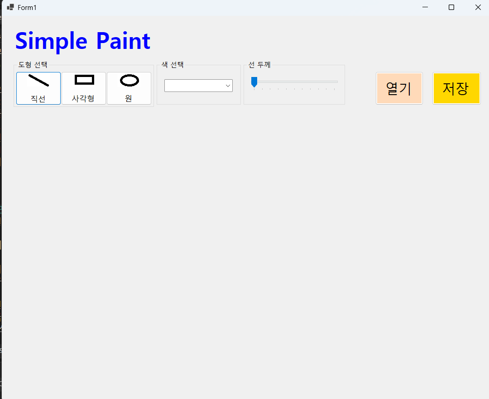

- 구현한 내용 (위 그림 참조)
	- UI 구성 : 도형선택, 색선택, 굵기선택, 캔버스 구성
	- 도형 선택 : 버튼 3개를 이용해서 직선, 사각형, 원 선택
	- 색 선택 : ComboBox를 이용해검은색, 빨간색, 파란색, 초록색 선택
	- 선 굵기 선택 : TrackBar를 이용해서 1~10까지 굵기 선택
	- 캔버스 : PictureBox를 이용해서 캔버스 구성

## 실행 화면 (과제2)
- 코드의 실행 스크린샷과 구현 내용 설명

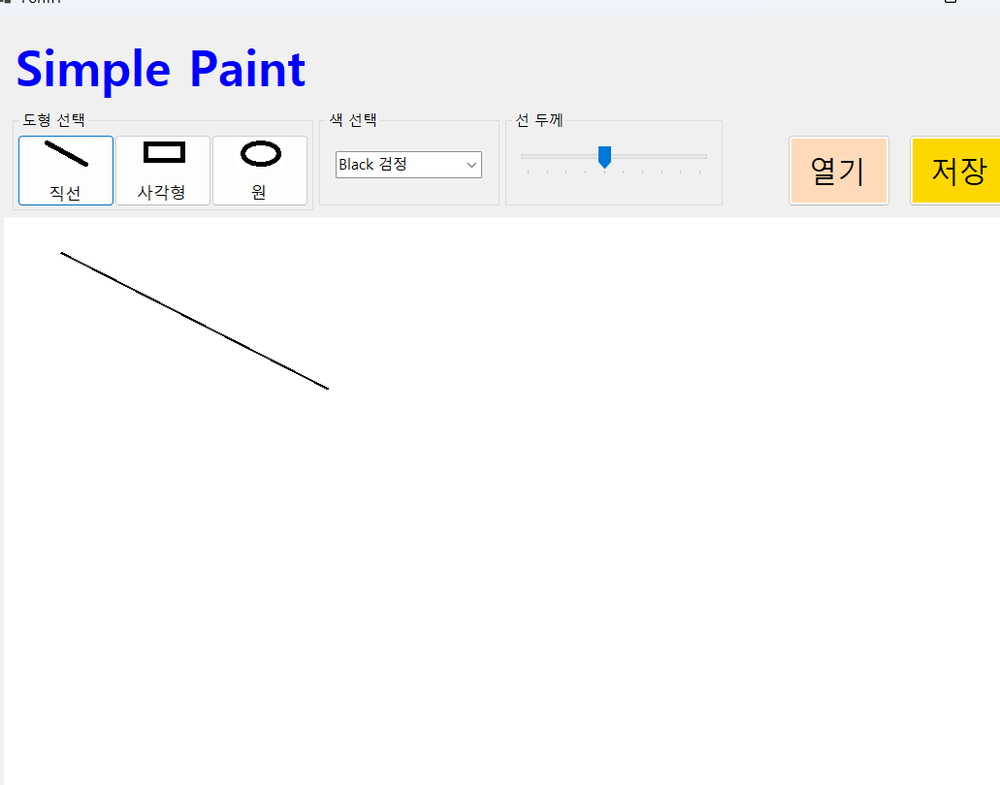
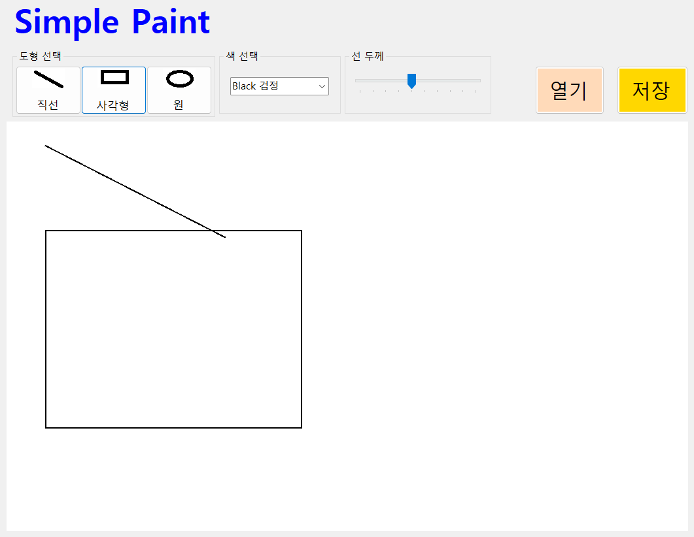
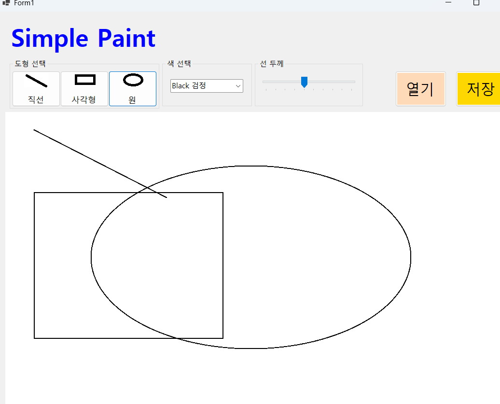
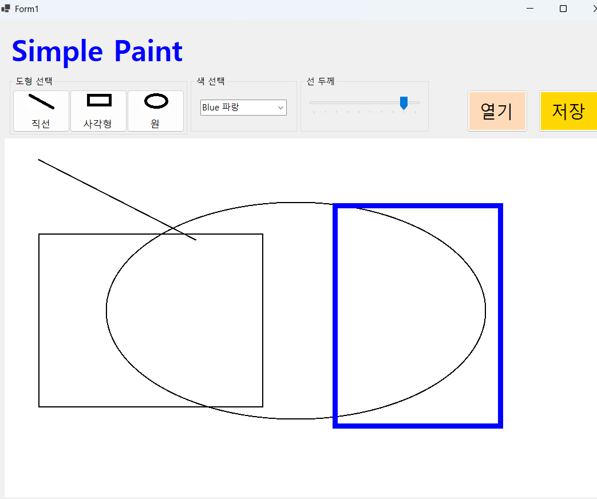

- 구현한 내용 (위 그림 참조)
	- 변수 설정 : 도형의 시작점과 끝점, 선택된 도형, 선택된 색상, 선택된 굵기
	- 초기 설정 : 폼이 로드될 때 선택된 도형을 직선으로 초기화, 선택된 색상을 검은색으로 초기화, 선택된 굵기를 5로 초기화
	- 마우스 클릭시 startPoint에 클릭한 위치 저장
	- 마우스 드래그시 IsDrawing 변수가 false일때 함수가 바로 종료되게 하고 이외에는 endPoint에 드래그한 위치 저장
	- 마우스를 땠을때 IsDrawing 변수를 false로 설정하고 도형을 그리는 함수 호출
	- 버튼 클릭으로 도형을 선택할 때마다 선택된 도형 변수 업데이트
	- switch문을 이용해서 선택된 도형에 따라 직선, 사각형, 원을 그리는 함수 호출 및 색상 선택

## 실행 화면 (과제3)
- 코드의 실행 스크린샷과 구현 내용 설명

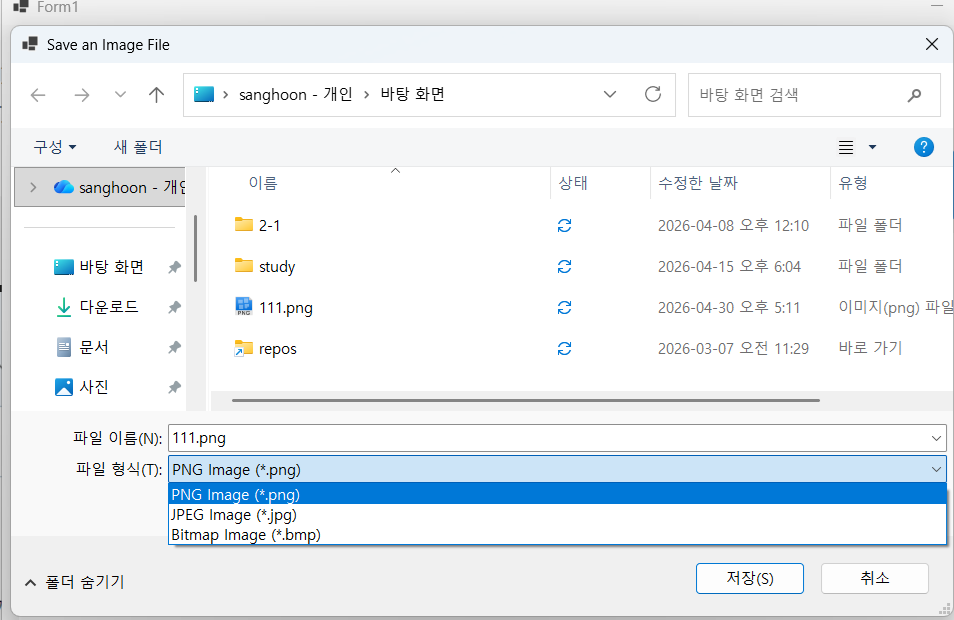
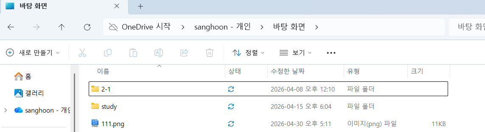

- 구현한 내용 (위 그림 참조)
	- 그림 저장 : SaveFileDialog를 이용해서 그림을 저장할 위치와 파일 이름을 선택하고, Bitmap 객체를 이용해서 PictureBox의 이미지를 저장 
	- 파일 확장자 : SaveFileDialog에서 필터를 설정해서 PNG, JPEG, BMP 형식으로 저장할 수 있도록 구현

## 실행 화면 (과제4)
- 코드의 실행 스크린샷과 구현 내용 설명

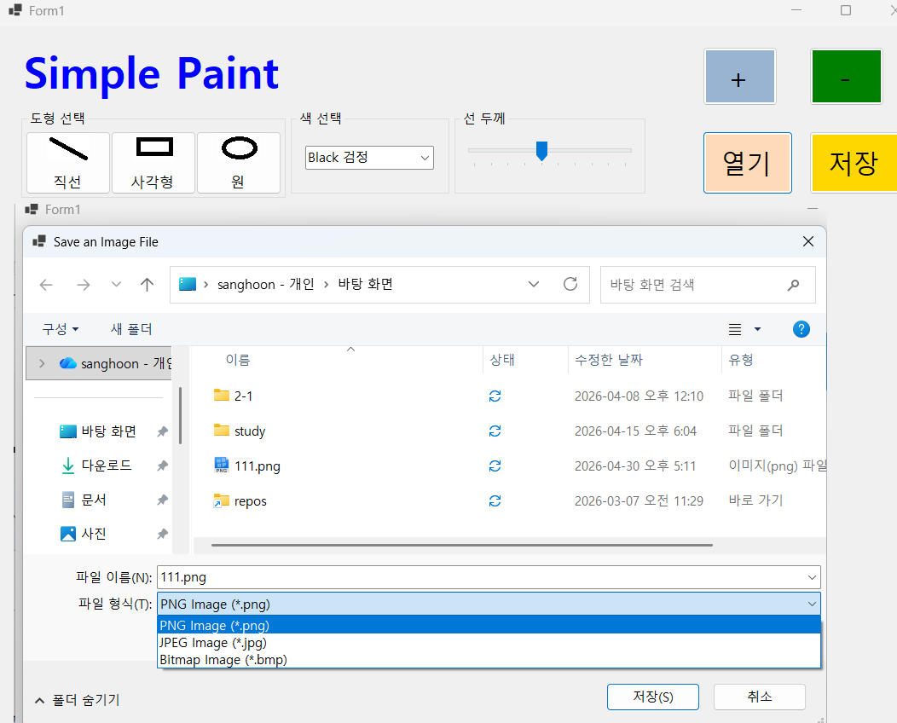
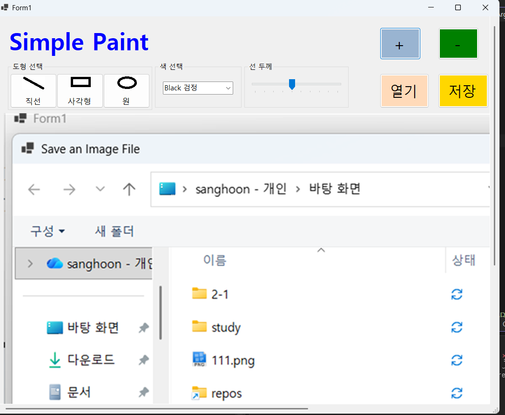
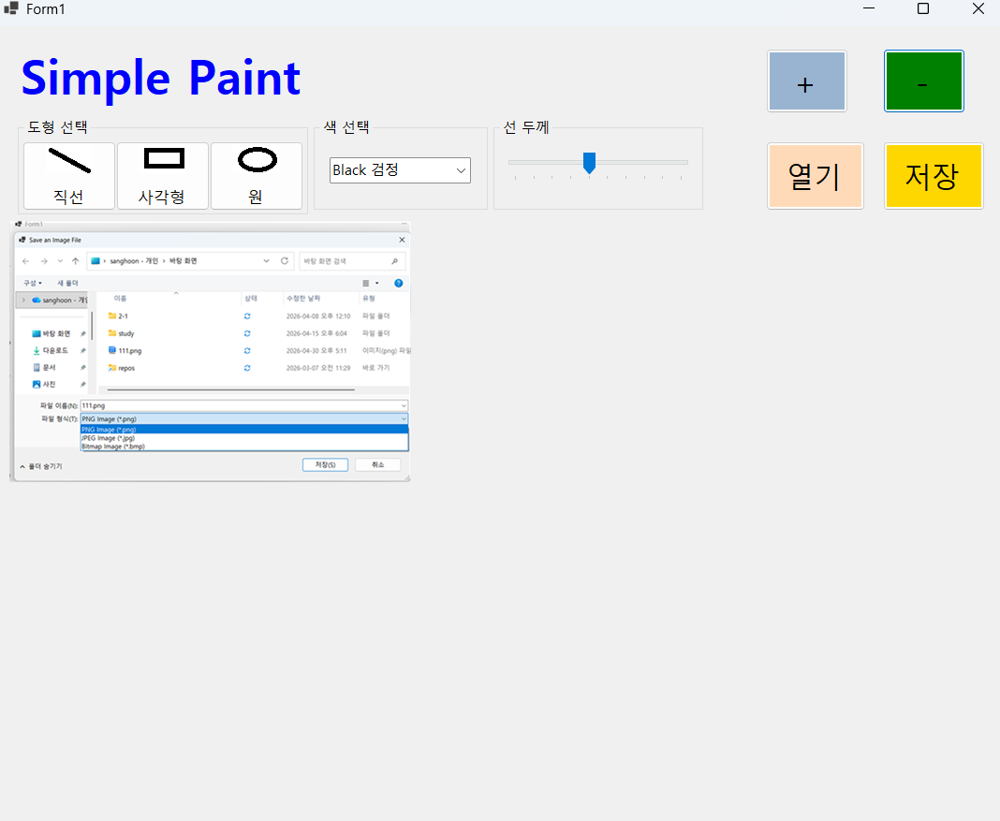
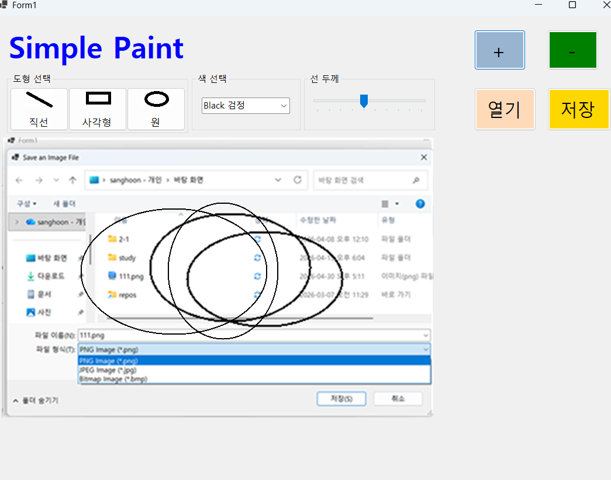

- 구현한 내용 (위 그림 참조)
	- 이미지를 캔버스에 표시 : OpenFileDialog에서 선택한 이미지 파일을 Bitmap 객체로 로드하고, PictureBox의 Image 속성에 할당해서 캔버스에 표시
	- 이미지 크기에 맞게 PictureBox 크기 조정 : OpenFileDialog에서 선택한 이미지의 크기에 맞게 PictureBox의 SizeMode 속성을 AutoSize로 설정해서 이미지가 캔버스에 맞게 표시되도록 구현
	- 스크롤바 추가 : PictureBox의 SizeMode 속성을 AutoSize로 설정하면 이미지가 PictureBox보다 클 때 스크롤바가 자동으로 나타나도록 구현
	- 확대 및 축소 기능 : TrackBar를 이용해서 확대 및 축소 비율을 조절할 수 있도록 구현. TrackBar의 ValueChanged 이벤트에서 PictureBox의 SizeMode 속성을 Zoom으로 설정하고, Size 속성을 조절해서 이미지 크기를 변경